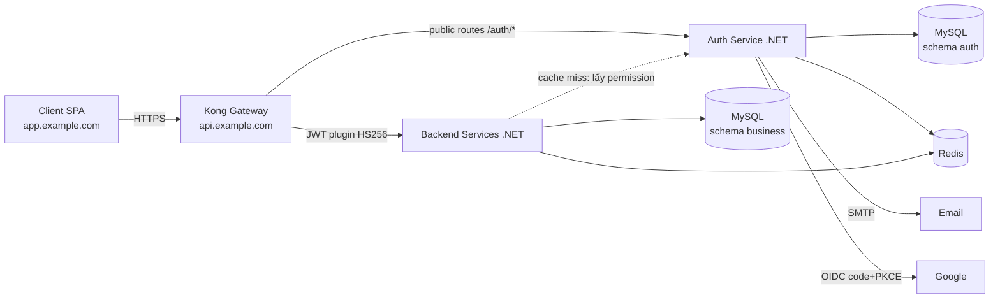
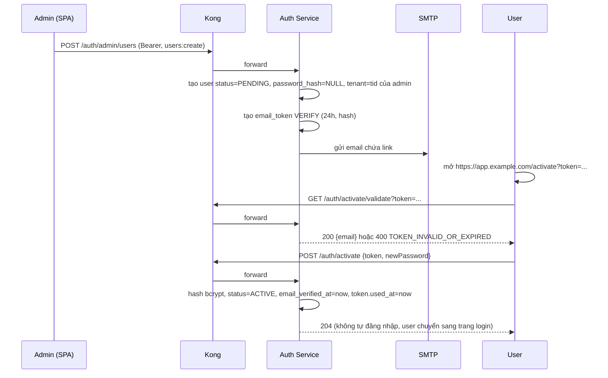
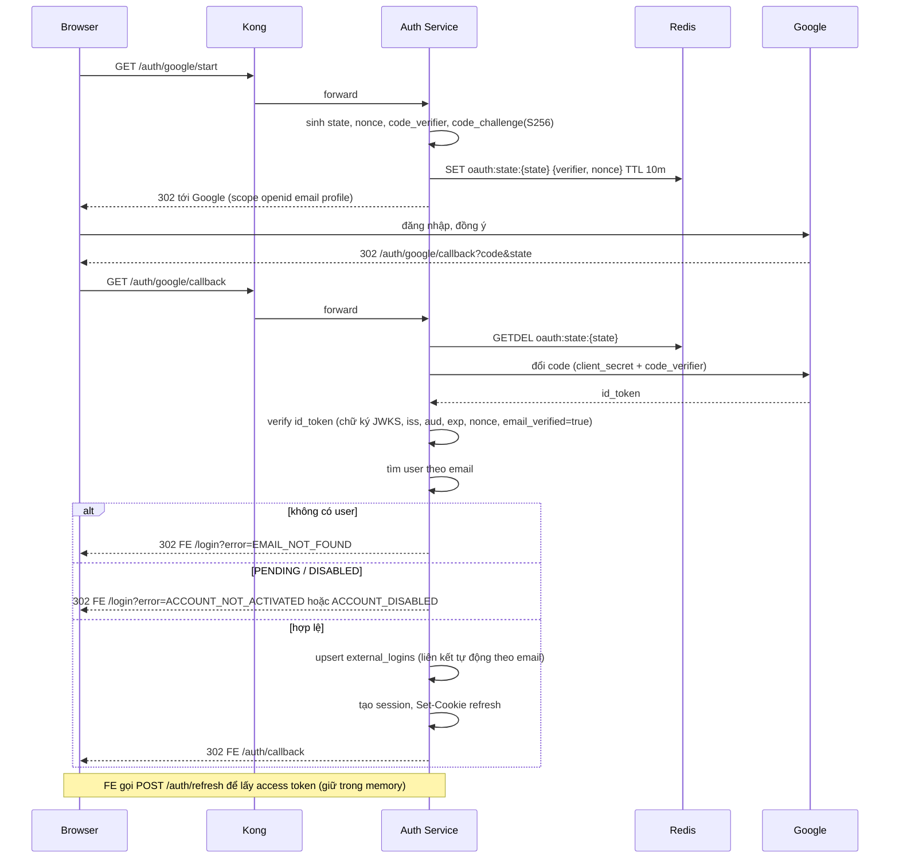
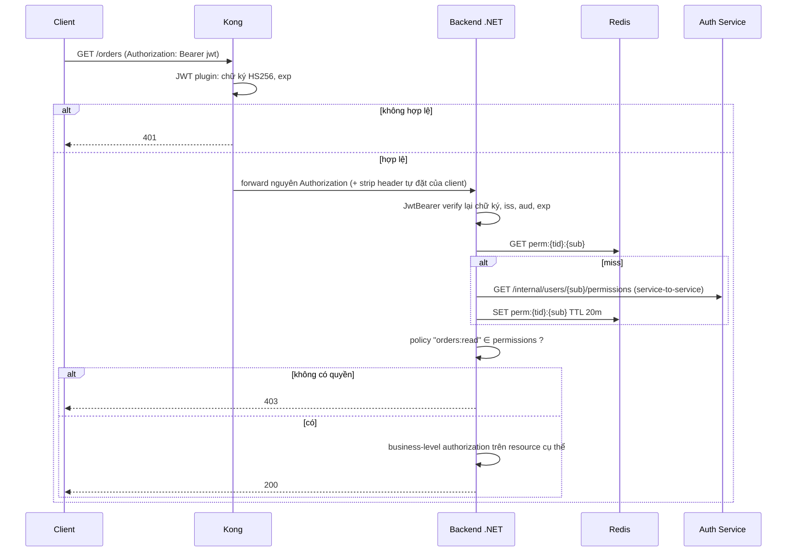

# SPEC: SSO Login, Authentication (Gateway) & Authorization (Backend)

Phiên bản: 1.0 · Ngôn ngữ: tiếng Việt, identifier/endpoint bằng tiếng Anh

---

## 0. Quy tắc cho agent (đọc trước)

1. **Không tự quyết định.** Gặp điểm mơ hồ, thiếu thông tin hoặc mâu thuẫn trong spec này thì **dừng và hỏi lại người giao việc**. Không tự chọn phương án rồi code tiếp.
2. Mục gắn nhãn **`[CHỐT]`** là yêu cầu đã được xác nhận, phải làm đúng.
3. Mục gắn nhãn **`[ĐỀ XUẤT]`** là chi tiết triển khai được đề xuất nhưng **chưa được xác nhận**. Chỉ làm khi mục đó đã được duyệt (người giao việc sẽ xoá nhãn hoặc xác nhận). Nếu chưa duyệt, hỏi trước khi làm.
4. Mục trong §14 "Câu hỏi còn mở" **không được code** cho đến khi có câu trả lời.
5. Không đưa secret, key, mật khẩu vào source code hay log. Mọi giá trị cấu hình lấy từ environment/secret store (xem §12).
6. Mỗi task hoàn thành phải đạt các tiêu chí nghiệm thu (AC) tương ứng ở §15 và có test.

---

## 1. Phạm vi

### Trong phạm vi
- Đăng nhập bằng email + mật khẩu, và bằng Google (OAuth2/OIDC Authorization Code + PKCE).
- Admin tạo user → email xác thực → user đặt mật khẩu → đăng nhập.
- Quên mật khẩu, đổi mật khẩu.
- Access token JWT (HS256), refresh token (rotation, token family, token version), session management (`logout`, `logout-all`, `sessions`).
- Khoá tài khoản tạm thời khi sai mật khẩu.
- Authentication tại gateway (Kong), authorization tại backend (.NET) với RBAC + permission cache Redis + business-level authorization.
- Multi-tenant (mỗi user thuộc đúng 1 tenant).

### Ngoài phạm vi `[ĐỀ XUẤT]`
- Auth Service **không** là OIDC Provider cho ứng dụng bên thứ ba (không có `/authorize`, client registry, discovery).
- Tạo/quản lý tenant (dùng seed script), super-admin xuyên tenant.
- Triển khai UI frontend (chỉ có hợp đồng hành vi client ở §9).
- MFA, đăng nhập bằng provider khác ngoài Google, blacklist access token.

---

## 2. Quyết định kiến trúc

| Hạng mục | Quyết định | Nhãn |
|---|---|---|
| Gateway | Kong | `[CHỐT]` |
| Backend | .NET | `[CHỐT]` |
| Auth Service | Service .NET **riêng**, schema MySQL riêng trên cùng MySQL server | `[CHỐT]` |
| DB | MySQL | `[CHỐT]` |
| Cache | Redis | `[CHỐT]` |
| Access token | JWT, ký **HS256**, sống **15 phút**, client giữ trong **memory**, gửi qua header `Authorization: Bearer` | `[CHỐT]` |
| Refresh token | Chuỗi random opaque, DB chỉ lưu **hash**, sống **3 ngày sliding**, trần tuyệt đối **30 ngày**, **rotation**, nằm trong cookie **HttpOnly** | `[CHỐT]` |
| Lưu refresh token | DB là nguồn sự thật, Redis là lớp tra cứu nhanh, Redis mất thì fallback DB | `[CHỐT]` |
| Authentication | Tại Kong: validate access token rồi forward **nguyên access token** xuống backend | `[CHỐT]` |
| Backend verify | Backend **vẫn verify lại chữ ký** HS256 bằng secret chung | `[CHỐT]` |
| Authorization | Tại backend: RBAC `User → Role → Permission`, permission dạng `resource:action` | `[CHỐT]` |
| Permission cache | Redis, TTL **20 phút**, key theo `tenantId` + `userId`, **invalidate ngay** khi admin đổi quyền | `[CHỐT]` |
| Mật khẩu | bcrypt | `[CHỐT]` |
| Khoá tài khoản | 5 lần sai (đếm theo email) → khoá 30 phút, tự mở; đăng nhập Google không tính vào bộ đếm | `[CHỐT]` |
| Cookie refresh | `HttpOnly; Secure; SameSite=Lax; Path=/auth`; frontend và API là hai subdomain cùng một site | `[CHỐT]` |
| Tài khoản | Chỉ admin tạo user; email là định danh đăng nhập | `[CHỐT]` |
| Google | Authorization Code + PKCE; email trùng → tự động liên kết; email không tồn tại → báo "tài khoản không tồn tại" | `[CHỐT]` |

### Sơ đồ tổng thể



---

## 3. Thuật ngữ & hằng số

| Tên | Giá trị | Nhãn |
|---|---|---|
| `ACCESS_TOKEN_TTL` | 15 phút | `[CHỐT]` |
| `REFRESH_TOKEN_TTL` | 3 ngày (sliding mỗi lần rotate) | `[CHỐT]` |
| `REFRESH_ABSOLUTE_MAX` | 30 ngày kể từ lúc đăng nhập ban đầu (tính từ `created_at` của family) | `[CHỐT]` |
| `PERMISSION_CACHE_TTL` | 20 phút | `[CHỐT]` |
| `MAX_FAILED_LOGINS` | 5 | `[CHỐT]` |
| `LOCK_DURATION` | 30 phút | `[CHỐT]` |
| `VERIFY_EMAIL_TTL` | 24 giờ, dùng một lần | `[CHỐT]` |
| `RESET_PASSWORD_TTL` | 30 phút, dùng một lần | `[CHỐT]` |
| `OAUTH_STATE_TTL` | 10 phút | `[ĐỀ XUẤT]` |
| `JWT_CLOCK_SKEW` | 30 giây | `[ĐỀ XUẤT]` |
| bcrypt cost | 12 | `[ĐỀ XUẤT]` |

- **Session** = một *refresh token family*. Mỗi lần đăng nhập tạo một family mới.
- **Token family**: chuỗi các refresh token nối tiếp nhau do rotation. Phát hiện dùng lại token đã rotate ⇒ thu hồi cả family.
- **Token version** (`users.token_version`): số nguyên tăng khi cần vô hiệu mọi refresh token của user (logout-all, reset password, admin disable). Refresh token lưu `token_version` lúc phát hành; khi refresh, nếu khác `users.token_version` thì từ chối.

---

## 4. Mô hình dữ liệu (MySQL, schema `auth`)

Dùng `utf8mb4`, id kiểu `CHAR(36)` UUID `[ĐỀ XUẤT]`, thời gian lưu UTC.

```sql
CREATE TABLE tenants (
  id CHAR(36) PRIMARY KEY,
  name VARCHAR(200) NOT NULL,
  status ENUM('ACTIVE','DISABLED') NOT NULL DEFAULT 'ACTIVE',
  created_at DATETIME(3) NOT NULL
);

CREATE TABLE users (
  id CHAR(36) PRIMARY KEY,
  tenant_id CHAR(36) NOT NULL,
  email VARCHAR(255) NOT NULL,                 -- lưu lower-case, UNIQUE toàn hệ thống
  full_name VARCHAR(200) NOT NULL,
  password_hash VARCHAR(100) NULL,             -- NULL cho đến khi user kích hoạt
  status ENUM('PENDING','ACTIVE','DISABLED') NOT NULL DEFAULT 'PENDING',
  email_verified_at DATETIME(3) NULL,
  failed_login_count INT NOT NULL DEFAULT 0,
  locked_until DATETIME(3) NULL,
  token_version INT NOT NULL DEFAULT 0,
  last_login_at DATETIME(3) NULL,
  created_by CHAR(36) NULL,
  created_at DATETIME(3) NOT NULL,
  updated_at DATETIME(3) NOT NULL,
  UNIQUE KEY uq_users_email (email),
  KEY ix_users_tenant (tenant_id),
  CONSTRAINT fk_users_tenant FOREIGN KEY (tenant_id) REFERENCES tenants(id)
);
-- Email phải unique TOÀN HỆ THỐNG vì đăng nhập Google chỉ có email, không có ngữ cảnh tenant.

CREATE TABLE roles (
  id CHAR(36) PRIMARY KEY,
  tenant_id CHAR(36) NOT NULL,                 -- [ĐỀ XUẤT] role thuộc tenant (xem §14 câu 3)
  name VARCHAR(100) NOT NULL,
  description VARCHAR(500) NULL,
  is_system TINYINT(1) NOT NULL DEFAULT 0,
  UNIQUE KEY uq_roles (tenant_id, name)
);

CREATE TABLE permissions (
  id CHAR(36) PRIMARY KEY,
  code VARCHAR(100) NOT NULL,                  -- dạng resource:action, ví dụ orders:read
  description VARCHAR(500) NULL,
  UNIQUE KEY uq_permissions_code (code)
);

CREATE TABLE role_permissions (
  role_id CHAR(36) NOT NULL,
  permission_id CHAR(36) NOT NULL,
  PRIMARY KEY (role_id, permission_id)
);

CREATE TABLE user_roles (
  user_id CHAR(36) NOT NULL,
  role_id CHAR(36) NOT NULL,
  PRIMARY KEY (user_id, role_id)
);

CREATE TABLE external_logins (
  id CHAR(36) PRIMARY KEY,
  user_id CHAR(36) NOT NULL,
  provider ENUM('GOOGLE') NOT NULL,
  provider_subject VARCHAR(255) NOT NULL,      -- claim "sub" của Google
  email VARCHAR(255) NOT NULL,
  linked_at DATETIME(3) NOT NULL,
  UNIQUE KEY uq_external (provider, provider_subject),
  UNIQUE KEY uq_external_user (user_id, provider)
);

CREATE TABLE refresh_token_families (          -- = session
  id CHAR(36) PRIMARY KEY,
  user_id CHAR(36) NOT NULL,
  tenant_id CHAR(36) NOT NULL,
  login_method ENUM('PASSWORD','GOOGLE') NOT NULL,
  user_agent VARCHAR(500) NULL,
  ip VARCHAR(45) NULL,
  created_at DATETIME(3) NOT NULL,
  last_used_at DATETIME(3) NOT NULL,
  absolute_expires_at DATETIME(3) NOT NULL,    -- created_at + 30 ngày
  revoked_at DATETIME(3) NULL,
  revoked_reason VARCHAR(50) NULL,             -- LOGOUT | LOGOUT_ALL | REUSE_DETECTED | PASSWORD_CHANGED | ADMIN | EXPIRED
  KEY ix_family_user (user_id, revoked_at)
);

CREATE TABLE refresh_tokens (
  id CHAR(36) PRIMARY KEY,
  family_id CHAR(36) NOT NULL,
  user_id CHAR(36) NOT NULL,
  token_hash CHAR(64) NOT NULL,                -- SHA-256 hex của token gốc
  token_version INT NOT NULL,
  status ENUM('ACTIVE','ROTATED','REVOKED') NOT NULL DEFAULT 'ACTIVE',
  issued_at DATETIME(3) NOT NULL,
  expires_at DATETIME(3) NOT NULL,
  used_at DATETIME(3) NULL,
  replaced_by_id CHAR(36) NULL,
  UNIQUE KEY uq_rt_hash (token_hash),
  KEY ix_rt_family (family_id, status)
);

CREATE TABLE email_tokens (
  id CHAR(36) PRIMARY KEY,
  user_id CHAR(36) NOT NULL,
  type ENUM('VERIFY','RESET') NOT NULL,
  token_hash CHAR(64) NOT NULL,
  expires_at DATETIME(3) NOT NULL,
  used_at DATETIME(3) NULL,
  created_at DATETIME(3) NOT NULL,
  UNIQUE KEY uq_email_token_hash (token_hash),
  KEY ix_email_token_user (user_id, type)
);

CREATE TABLE auth_events (                     -- [ĐỀ XUẤT] audit log
  id BIGINT AUTO_INCREMENT PRIMARY KEY,
  tenant_id CHAR(36) NULL,
  user_id CHAR(36) NULL,
  type VARCHAR(50) NOT NULL,                   -- LOGIN_OK, LOGIN_FAIL, LOCKED, REFRESH, REUSE_DETECTED, LOGOUT, PASSWORD_RESET ...
  ip VARCHAR(45) NULL,
  user_agent VARCHAR(500) NULL,
  meta JSON NULL,
  created_at DATETIME(3) NOT NULL,
  KEY ix_events_user (user_id, created_at)
);
```

Quy tắc:
- Refresh token và email token là chuỗi random 32 byte (CSPRNG), mã hoá base64url, **chỉ lưu SHA-256 hash**. Không bao giờ log token gốc.
- Mật khẩu: bcrypt, tối đa 72 byte đầu vào (giới hạn của bcrypt, validate độ dài trước khi băm).
- Policy mật khẩu `[ĐỀ XUẤT]`: 8–72 ký tự, có ít nhất 1 chữ và 1 số.

---

## 5. Access token (JWT)

Header: `{"alg":"HS256","typ":"JWT"}`.

Claims `[ĐỀ XUẤT]` (riêng `tid` là `[CHỐT]`):

| Claim | Ý nghĩa |
|---|---|
| `iss` | Hằng số cấu hình, ví dụ `sso-auth` (đồng thời là `key` của Kong consumer) |
| `aud` | Hằng số cấu hình, ví dụ `api` |
| `sub` | `userId` |
| `tid` | `tenantId` `[CHỐT]` |
| `sid` | `familyId` của session hiện tại |
| `email` | Email user |
| `iat`, `exp` | `exp = iat + 15 phút` |
| `jti` | UUID |

- **Không** đưa role/permission vào JWT (permission nằm trong Redis theo yêu cầu).
- Secret HS256 ≥ 256 bit, dùng chung cho Auth Service (ký), Kong (validate), Backend (verify lại). Chỉ chấp nhận `alg=HS256` khi verify (chống alg confusion, từ chối `none`).
- Access token vẫn hợp lệ tối đa 15 phút sau logout (chấp nhận, không blacklist) `[CHỐT]`.

---

## 6. Các luồng

### 6.1 Admin tạo user → xác thực email → đặt mật khẩu



- Nếu email đã tồn tại → `409 EMAIL_ALREADY_EXISTS`.
- Admin chỉ tạo user trong **tenant của chính mình** (`tid` từ JWT, không nhận từ body).
- Admin có thể gửi lại email verify (`POST /auth/admin/users/{id}/resend-verification`): vô hiệu các token VERIFY cũ chưa dùng, tạo token mới.

### 6.2 Đăng nhập email + mật khẩu

`POST /auth/login {email, password}`

Thứ tự kiểm tra:
1. Chuẩn hoá email (trim, lower-case). Không tìm thấy user ⇒ trả `401 INVALID_CREDENTIALS` (chạy một phép bcrypt giả để giảm timing leak `[ĐỀ XUẤT]`).
2. `status=PENDING` ⇒ `403 ACCOUNT_NOT_ACTIVATED`; `status=DISABLED` ⇒ `403 ACCOUNT_DISABLED`.
3. `locked_until > now` ⇒ `423 ACCOUNT_LOCKED` kèm `lockedUntil`.
4. Sai mật khẩu ⇒ `failed_login_count++`; nếu đạt 5 ⇒ `locked_until = now + 30 phút`, `failed_login_count = 0`; trả `401 INVALID_CREDENTIALS` (lần sai thứ 5 trả `423 ACCOUNT_LOCKED`).
5. Đúng mật khẩu ⇒ `failed_login_count = 0`, `locked_until = NULL`, `last_login_at = now`, tạo session (§6.4).

Phản hồi thành công `200`:
```json
{ "accessToken": "<jwt>", "expiresIn": 900, "tokenType": "Bearer" }
```
kèm `Set-Cookie` refresh token (§8).

Khi `locked_until` đã qua, lần đăng nhập kế tiếp tự động coi như mở khoá (không cần job).

### 6.3 Đăng nhập Google (Authorization Code + PKCE)

Auth Service đóng vai client bảo mật, xử lý toàn bộ trao đổi code. Access token không bao giờ nằm trên URL.



- `state` thiếu/hết hạn/không khớp ⇒ 302 về FE với `error=INVALID_STATE`.
- Google `email_verified != true` ⇒ từ chối (`error=GOOGLE_EMAIL_NOT_VERIFIED`).
- Lỗi đăng nhập Google **không** tăng `failed_login_count` `[CHỐT]`.
- Trường hợp user đang bị khoá do sai mật khẩu mà đăng nhập Google: **xem §14 câu 1**, chưa code.
- Đã liên kết `provider_subject` này với user khác ⇒ từ chối `error=GOOGLE_ACCOUNT_CONFLICT`.

### 6.4 Tạo session (dùng chung cho password và Google)

1. Tạo `refresh_token_families` (`absolute_expires_at = now + 30 ngày`).
2. Sinh refresh token ngẫu nhiên, lưu `refresh_tokens` (`ACTIVE`, `expires_at = now + 3 ngày`, `token_version = users.token_version`) và ghi Redis `rt:{hash}`.
3. Nạp permission của user vào Redis `perm:{tid}:{uid}` TTL 20 phút (§7.2).
4. Ký access token (§5).
5. Set cookie refresh (§8).

### 6.5 Refresh (rotation)

`POST /auth/refresh` (không body, đọc cookie).

```mermaid
sequenceDiagram
    participant C as Client
    participant A as Auth Service
    participant R as Redis
    participant D as MySQL
    C->>A: POST /auth/refresh (cookie rt)
    A->>A: hash = SHA256(rt)
    A->>R: GET rt:{hash}
    alt miss
        A->>D: SELECT refresh_tokens WHERE token_hash=hash
    end
    alt không tìm thấy / hết hạn / family revoked / quá absolute / user không ACTIVE / token_version lệch
        A-->>C: 401 + xoá cookie
    else status = ROTATED (dùng lại token cũ)
        A->>D: revoke cả family (REUSE_DETECTED)
        A->>R: xoá các rt:* của family
        A-->>C: 401 REFRESH_TOKEN_REUSED + xoá cookie
    else ACTIVE
        A->>D: token cũ -> ROTATED; tạo token mới (cùng family)
        A->>R: DEL rt:{old}; SET rt:{new}
        A->>R: SET perm:{tid}:{uid} TTL 20m (nạp lại)
        A-->>C: 200 {accessToken} + Set-Cookie token mới
    end
```

- `expires_at` token mới = `min(now + 3 ngày, family.absolute_expires_at)`. Hết trần 30 ngày ⇒ buộc đăng nhập lại.
- Cập nhật `family.last_used_at`.
- Thực hiện rotate trong một transaction DB; đảm bảo hai request đồng thời cùng một token chỉ một request thắng. Cách xử lý request thua (grace window hay 401 thẳng): **xem §14 câu 4**. Mặc định chưa có grace window, client phải single-flight (§9).

### 6.6 Logout / Logout-all / Sessions

| Endpoint | Auth | Hành vi |
|---|---|---|
| `POST /auth/logout` | cookie refresh (không cần access token) | Revoke family hiện tại (`LOGOUT`), xoá `rt:*` tương ứng, xoá cookie. Luôn trả `204`, kể cả cookie thiếu/không hợp lệ |
| `POST /auth/logout-all` | Bearer | Revoke mọi family của user (`LOGOUT_ALL`), `users.token_version++`, xoá `rt:*`, xoá cookie |
| `GET /auth/sessions` | Bearer | Danh sách family chưa revoke, chưa quá hạn: `id`, `loginMethod`, `userAgent`, `ip`, `createdAt`, `lastUsedAt`, `current` (so `sid`) |
| `DELETE /auth/sessions/{id}` `[ĐỀ XUẤT]` | Bearer | Revoke một session của chính user; không cho thao tác session của người khác (`404`) |

Không blacklist access token `[CHỐT]`.

### 6.7 Quên / đặt lại / đổi mật khẩu

- `POST /auth/forgot-password {email}`: luôn trả `204` (không lộ email có tồn tại). Nếu user `ACTIVE`: vô hiệu token RESET cũ, tạo token mới 30 phút dùng một lần, gửi email link `https://app.example.com/reset-password?token=...`.
- `POST /auth/reset-password {token, newPassword}`: token hợp lệ, chưa dùng ⇒ đặt mật khẩu, đánh dấu `used_at`, `token_version++`, revoke mọi session (`PASSWORD_CHANGED`). Có reset `failed_login_count` và `locked_until` hay không: **xem §14 câu 5**.
- `POST /auth/change-password {currentPassword, newPassword}` (Bearer): sai mật khẩu hiện tại ⇒ `400`. Thành công ⇒ revoke mọi session **trừ session hiện tại** `[ĐỀ XUẤT]`. Sai mật khẩu hiện tại ở đây không tính vào bộ đếm khoá `[ĐỀ XUẤT]`.
- User `PENDING` gọi forgot-password: không gửi gì (vẫn `204`).

### 6.8 Request tới backend (authentication + authorization)



---

## 7. Authorization

### 7.1 Mô hình RBAC `[CHỐT]`
`User → Role → Permission`. Permission code `resource:action` (ví dụ `orders:read`, `users:create`). So khớp **chính xác** theo chuỗi, không hỗ trợ wildcard `[ĐỀ XUẤT]`.

### 7.2 Permission cache `[CHỐT]`
- Key: `perm:{tenantId}:{userId}` · Value: JSON mảng permission code (hoặc Redis SET) · TTL 20 phút.
- Ghi khi: đăng nhập, refresh, và khi backend cache miss.
- **Invalidate ngay** (xoá key) khi admin: đổi role của user, đổi permission của role (xoá key của mọi user đang có role đó), disable user, xoá role.
- Chống cache stampede khi miss: single-flight theo key trong process `[ĐỀ XUẤT]`.
- Khi backend gặp cache miss, nguồn nạp lại permission: **xem §14 câu 2**. (Trong sơ đồ §6.8 là phương án đề xuất, chưa được duyệt.)

### 7.3 Coarse authorization (endpoint policy) `[CHỐT]`
Policy-based authorization của ASP.NET Core: `[Authorize(Policy = "orders:read")]` (hoặc attribute `[RequirePermission("orders:read")]`) dùng `IAuthorizationHandler` tuỳ biến: lấy `tid`, `sub` từ claims đã verify → đọc permission từ Redis → kiểm tra. Thiếu quyền ⇒ `403`, token sai/hết hạn ⇒ `401`.

### 7.4 Business-level authorization / ReBAC `[CHỐT]`
Trong **Application layer**, quyết định theo resource cụ thể (ví dụ "chỉ người tạo đơn hoặc quản lý chi nhánh được sửa đơn"). Cấu trúc đề xuất `[ĐỀ XUẤT]`: interface `IResourceAuthorizer<TResource>` với `Task<AuthorizationResult> AuthorizeAsync(CurrentUser user, TResource resource, string action)`, được gọi trong use-case handler trước khi thực hiện thao tác.

### 7.5 Cách ly tenant (bắt buộc) `[CHỐT: multi-tenant]`
- `tenantId` chỉ lấy từ claim `tid` đã verify, **không bao giờ** từ body/query/header do client gửi.
- Mọi truy vấn dữ liệu nghiệp vụ phải lọc theo `tenant_id` (ví dụ EF Core global query filter). Có test chứng minh user tenant A không đọc/sửa được dữ liệu tenant B.

---

## 8. Cookie refresh token `[CHỐT]`

```
Set-Cookie: rt=<token>; HttpOnly; Secure; SameSite=Lax; Path=/auth; Max-Age=<giây còn lại>
```

- Cookie **host-only** do `api.example.com` đặt (không set `Domain`) `[ĐỀ XUẤT]`.
- Xoá cookie: cùng tên, cùng `Path=/auth`, `Max-Age=0`.
- `Path=/auth` ⇒ cookie chỉ gửi tới các endpoint `/auth/*`. Vì vậy mọi endpoint dùng cookie (`/auth/refresh`, `/auth/logout`, ...) phải nằm dưới `/auth`.
- CORS (cấu hình ở Kong hoặc service): `Access-Control-Allow-Origin` = đúng origin frontend (không dùng `*`), `Access-Control-Allow-Credentials: true`, cho phép header `Authorization`, `Content-Type`.
- CSRF `[ĐỀ XUẤT]`: ngoài `SameSite=Lax`, các endpoint dùng cookie (`/auth/refresh`, `/auth/logout`) chỉ nhận `POST` và kiểm tra header `Origin` nằm trong allow-list, sai ⇒ `403`.

---

## 9. Hợp đồng hành vi phía client (để backend/agent FE bám theo)

1. Access token chỉ giữ trong **memory** (biến JS), không lưu localStorage/sessionStorage/cookie.
2. Mọi lời gọi `/auth/*` dùng `credentials: 'include'`.
3. Khi tải app (F5) không có access token: gọi `POST /auth/refresh`; thành công ⇒ có access token, thất bại ⇒ chuyển trang login.
4. Gặp `401` từ API: thực hiện **một** lần refresh (single-flight: nhiều request song song dùng chung một promise refresh), rồi gọi lại request một lần. Refresh lỗi ⇒ xoá token trong memory, chuyển login.
5. Sau callback Google: trang `/auth/callback` của FE gọi `POST /auth/refresh` để lấy access token.
6. Hiển thị lỗi từ query `?error=` ở trang login (`EMAIL_NOT_FOUND` ⇒ "Tài khoản không tồn tại trong hệ thống", ...).

---

## 10. API contract

Quy ước: base `https://api.example.com`. Lỗi trả dạng RFC 7807 (`application/problem+json`) kèm trường `code`. Cột **Kong** cho biết route có bật JWT plugin hay không.

| # | Method & Path | Kong | Auth | Request | Response |
|---|---|---|---|---|---|
| 1 | `POST /auth/login` | public | — | `{email,password}` | 200 `{accessToken,expiresIn,tokenType}` + cookie |
| 2 | `GET /auth/google/start` | public | — | — | 302 Google |
| 3 | `GET /auth/google/callback` | public | — | `code,state` | 302 FE |
| 4 | `POST /auth/refresh` | public | cookie | — | 200 `{accessToken,expiresIn,tokenType}` + cookie mới |
| 5 | `POST /auth/logout` | public | cookie | — | 204 |
| 6 | `GET /auth/activate/validate?token=` | public | — | — | 200 `{email}` |
| 7 | `POST /auth/activate` | public | — | `{token,newPassword}` | 204 |
| 8 | `POST /auth/forgot-password` | public | — | `{email}` | 204 |
| 9 | `POST /auth/reset-password` | public | — | `{token,newPassword}` | 204 |
| 10 | `POST /auth/change-password` | JWT | Bearer | `{currentPassword,newPassword}` | 204 |
| 11 | `POST /auth/logout-all` | JWT | Bearer | — | 204 |
| 12 | `GET /auth/sessions` | JWT | Bearer | — | 200 `[{id,loginMethod,userAgent,ip,createdAt,lastUsedAt,current}]` |
| 13 | `DELETE /auth/sessions/{id}` `[ĐỀ XUẤT]` | JWT | Bearer | — | 204 |
| 14 | `GET /auth/me` `[ĐỀ XUẤT]` | JWT | Bearer | — | 200 `{id,email,fullName,tenantId}` |
| 15 | `POST /auth/admin/users` | JWT | `users:create` | `{email,fullName,roleIds[]}` | 201 `{id}` |
| 16 | `POST /auth/admin/users/{id}/resend-verification` | JWT | `users:create` | — | 204 |
| 17 | `PATCH /auth/admin/users/{id}` | JWT | `users:update` | `{fullName?,status?}` (status: ACTIVE/DISABLED) | 200 |
| 18 | `PUT /auth/admin/users/{id}/roles` | JWT | `users:update` | `{roleIds[]}` | 204 (+ invalidate cache) |
| 19 | `POST /auth/admin/users/{id}/unlock` | JWT | `users:update` | — | 204 |
| 20 | `GET /auth/admin/users` | JWT | `users:read` | phân trang | 200 |
| 21 | `GET/POST /auth/admin/roles`, `PUT/DELETE /auth/admin/roles/{id}` | JWT | `roles:read` / `roles:manage` | — | CRUD role |
| 22 | `PUT /auth/admin/roles/{id}/permissions` | JWT | `roles:manage` | `{permissionCodes[]}` | 204 (+ invalidate cache mọi user của role) |
| 23 | `GET /auth/admin/permissions` | JWT | `roles:read` | — | 200 danh sách permission |
| 24 | `GET /internal/users/{userId}/permissions` `[ĐỀ XUẤT]` | **không expose qua Kong** | service-to-service | — | 200 `{permissions[]}` |

Lưu ý:
- Endpoint 15–23 yêu cầu đúng permission, kiểm tra theo §7.3, chỉ tác động trong tenant của người gọi.
- Endpoint 24 chỉ truy cập được từ mạng nội bộ (không có route trên Kong), cơ chế xác thực service-to-service: **xem §14 câu 2**.
- Admin vô hiệu hoá user (`status=DISABLED`) ⇒ `token_version++`, revoke mọi session, xoá permission cache.

### Mã lỗi `[ĐỀ XUẤT]`

| HTTP | `code` | Khi nào |
|---|---|---|
| 400 | `VALIDATION_ERROR` | Dữ liệu sai định dạng, mật khẩu không đạt policy |
| 400 | `TOKEN_INVALID_OR_EXPIRED` | Token email hết hạn / đã dùng / sai |
| 401 | `INVALID_CREDENTIALS` | Sai email hoặc mật khẩu |
| 401 | `UNAUTHENTICATED` | Thiếu/sai/hết hạn access token |
| 401 | `SESSION_EXPIRED` | Refresh token không hợp lệ/hết hạn/quá trần 30 ngày |
| 401 | `REFRESH_TOKEN_REUSED` | Phát hiện dùng lại refresh token đã rotate |
| 403 | `ACCOUNT_NOT_ACTIVATED` / `ACCOUNT_DISABLED` | Trạng thái user |
| 403 | `FORBIDDEN` | Thiếu permission hoặc không qua business authorization |
| 409 | `EMAIL_ALREADY_EXISTS` | Tạo user trùng email |
| 423 | `ACCOUNT_LOCKED` | Đang bị khoá, kèm `lockedUntil` |
| 429 | `RATE_LIMITED` | Vượt rate limit |

---

## 11. Cấu hình Kong

1. Hai nhóm route tới Auth Service:
   - **Public (không JWT plugin):** endpoint 1–9 ở §10.
   - **Protected (JWT plugin):** endpoint 10–23.
2. Mọi route tới Backend: bật plugin `jwt` (đọc `Authorization: Bearer`).
3. Plugin `jwt`: consumer có credential `algorithm=HS256`, `key` = giá trị claim `iss`, `secret` = secret chung; `claims_to_verify: ["exp"]`.
4. Không đăng ký route nào cho `/internal/*`.
5. Forward `Authorization` **nguyên vẹn** xuống backend `[CHỐT]`.
6. Identity headers nội bộ (`X-User-Id`, `X-Tenant-Id`) là **tuỳ chọn** `[CHỐT]`. Nếu dùng: Kong phải **xoá** mọi header cùng tên do client gửi, và backend **không được tin** các header này làm nguồn danh tính, nguồn sự thật là JWT đã verify. Lưu ý plugin `jwt` chuẩn của Kong không tự trích claim thành header, cần plugin tuỳ chỉnh nếu muốn; chưa làm trừ khi được yêu cầu.
7. CORS plugin theo §8.
8. Rate limiting `[ĐỀ XUẤT]`: áp dụng cho `/auth/login`, `/auth/forgot-password`, `/auth/refresh`, `/auth/google/*` theo IP.

---

## 12. Cấu hình & bí mật

| Biến | Dùng bởi | Ghi chú |
|---|---|---|
| `JWT_HS256_SECRET` | Auth, Kong, Backend | ≥ 32 byte ngẫu nhiên, lấy từ secret store |
| `JWT_ISSUER`, `JWT_AUDIENCE` | Auth, Backend, Kong consumer | |
| `GOOGLE_CLIENT_ID`, `GOOGLE_CLIENT_SECRET`, `GOOGLE_REDIRECT_URI` | Auth | Redirect URI đăng ký trên Google trỏ tới `/auth/google/callback` |
| `FRONTEND_BASE_URL`, `ALLOWED_ORIGINS` | Auth, Kong | Dùng cho redirect, link email, CORS, kiểm tra Origin |
| `MYSQL_CONNECTION_AUTH`, `MYSQL_CONNECTION_BIZ` | Auth / Backend | Schema riêng |
| `REDIS_CONNECTION` | Auth, Backend | |
| `SMTP_HOST/PORT/USER/PASSWORD/FROM`, `SMTP_USE_TLS` | Auth | SMTP cấu hình được `[CHỐT]` |
| Các hằng số §3 | Auth | Đọc từ config, không hard-code |

Redis key tổng hợp:

| Key | Giá trị | TTL |
|---|---|---|
| `rt:{sha256(refreshToken)}` | `{userId,tenantId,familyId,tokenVersion,expiresAt}` | đến `expires_at` |
| `perm:{tenantId}:{userId}` | danh sách permission | 20 phút |
| `oauth:state:{state}` | `{codeVerifier,nonce}` | 10 phút |

Redis không có dữ liệu (restart/flush) ⇒ hệ thống phải tiếp tục hoạt động bằng fallback DB (refresh) và nạp lại (permission). Có test cho kịch bản này.

---

## 13. Danh sách task

Phụ thuộc ghi trong ngoặc. Mỗi task có test đi kèm.

| ID | Task | Phụ thuộc |
|---|---|---|
| T0 | Khởi tạo solution: Auth Service, cấu trúc layer, config, logging (không log secret/token), Docker Compose (MySQL, Redis, Kong, MailHog cho dev) | — |
| T1 | Migration schema `auth` (§4) + seed: 1 tenant mẫu, danh sách permission, role admin, 1 user admin ở trạng thái ACTIVE | T0 |
| T2 | Dịch vụ băm mật khẩu (bcrypt), sinh/băm token (CSPRNG + SHA-256), validate policy mật khẩu | T0 |
| T3 | Phát hành & verify JWT HS256 (§5) | T0 |
| T4 | Admin tạo user + email verify + activate (§6.1) + dịch vụ gửi email SMTP | T1, T2 |
| T5 | Login mật khẩu + khoá tài khoản (§6.2) | T1–T3 |
| T6 | Session/refresh: tạo session, rotation, reuse detection, fallback DB/Redis (§6.4, 6.5) | T5 |
| T7 | Logout, logout-all, sessions (§6.6) | T6 |
| T8 | Quên/đặt lại/đổi mật khẩu (§6.7) | T4, T6 |
| T9 | Đăng nhập Google (§6.3) | T6 |
| T10 | Admin API: user, role, permission + invalidate permission cache (§7.2, §10 mục 15–23) | T1 |
| T11 | Cấu hình Kong: route public/protected, JWT plugin, CORS, rate limit, strip header (§11) | T3 |
| T12 | Backend: JwtBearer verify lại, permission policy handler, permission store Redis, tenant isolation, ví dụ endpoint mẫu và `IResourceAuthorizer` (§7) | T3, T10 |
| T13 | Audit log `auth_events` (nếu `[ĐỀ XUẤT]` được duyệt) | T5–T9 |
| T14 | Test tích hợp end-to-end qua Kong, test bảo mật, tài liệu chạy local | tất cả |

---

## 14. Câu hỏi còn mở (KHÔNG code phần này cho đến khi có trả lời)

1. **User đang bị khoá (do sai mật khẩu) có đăng nhập được bằng Google không?** Hiện chỉ chốt "đăng nhập Google không tính vào bộ đếm".
2. **Khi backend cache miss permission, lấy từ đâu?** Phương án đề xuất: gọi endpoint nội bộ của Auth Service (mục 24 §10). Cần chốt thêm cơ chế xác thực service-to-service (API key nội bộ / mTLS / network policy).
3. **Role thuộc tenant hay dùng chung toàn hệ thống?** Spec đang đề xuất role thuộc tenant, permission là danh mục chung.
4. **Hai request refresh đồng thời cùng một token:** chấp nhận request thua nhận `401` (client single-flight), hay thêm grace window (ví dụ 10 giây) để không bị coi là reuse?
5. **Reset password có tự mở khoá tài khoản** (reset `failed_login_count`, `locked_until`) hay không?
6. **Phân biệt thông báo khoá:** `423 ACCOUNT_LOCKED` có làm lộ việc email tồn tại; chấp nhận hay muốn thông báo chung?

---

## 15. Tiêu chí nghiệm thu (AC)

### Đăng nhập & khoá
- **AC-1** Đăng nhập đúng email/mật khẩu của user `ACTIVE` ⇒ 200, có `accessToken` (exp = iat + 900s) và cookie `rt` với đủ `HttpOnly; Secure; SameSite=Lax; Path=/auth`; response body **không** chứa refresh token.
- **AC-2** Sai mật khẩu 4 lần ⇒ vẫn `401`; lần thứ 5 ⇒ `423` và `locked_until = now + 30 phút`; trong thời gian khoá, đăng nhập đúng mật khẩu vẫn `423`.
- **AC-3** Sau 30 phút, đăng nhập đúng ⇒ thành công, bộ đếm về 0.
- **AC-4** Đăng nhập thành công giữa chừng reset `failed_login_count` về 0.
- **AC-5** User `PENDING` ⇒ `403 ACCOUNT_NOT_ACTIVATED`; `DISABLED` ⇒ `403 ACCOUNT_DISABLED`.
- **AC-6** Email viết hoa/thường khác nhau vẫn đăng nhập được (chuẩn hoá lower-case).

### Tạo user & kích hoạt
- **AC-7** Admin có `users:create` tạo user ⇒ 201, user `PENDING`, `password_hash` NULL, email được gửi chứa link; DB chỉ lưu hash của token.
- **AC-8** Admin tạo trùng email ⇒ 409; admin không có `users:create` ⇒ 403; user tạo ra luôn thuộc tenant của admin.
- **AC-9** `POST /auth/activate` với token hợp lệ ⇒ 204, user `ACTIVE`, `email_verified_at` có giá trị, token không dùng lại được (lần 2 ⇒ 400).
- **AC-10** Token verify quá 24 giờ ⇒ 400 `TOKEN_INVALID_OR_EXPIRED`; sau khi admin gửi lại thì token cũ chưa dùng bị vô hiệu, token mới dùng được.
- **AC-11** Mật khẩu vi phạm policy ⇒ 400 `VALIDATION_ERROR`.

### Google
- **AC-12** Email Google khớp user `ACTIVE` ⇒ tạo session, 302 về FE, có cookie `rt`; `external_logins` được tạo (liên kết tự động); lần sau đăng nhập tiếp tục dùng cùng liên kết.
- **AC-13** Email Google không có trong hệ thống ⇒ 302 về FE với `error=EMAIL_NOT_FOUND`, không tạo user, không tạo session.
- **AC-14** `state` sai hoặc dùng lần hai ⇒ từ chối; `code_verifier` PKCE được dùng khi đổi code; `nonce` và `email_verified` được kiểm tra.
- **AC-15** Đăng nhập Google thất bại không làm tăng `failed_login_count`.

### Refresh & session
- **AC-16** Refresh với cookie hợp lệ ⇒ 200, access token mới, cookie mới; token cũ chuyển `ROTATED`; `expires_at` mới = `min(now+3d, family.absolute_expires_at)`.
- **AC-17** Dùng lại refresh token đã `ROTATED` ⇒ 401 `REFRESH_TOKEN_REUSED`, **toàn bộ family** bị revoke, token mới nhất của family cũng không dùng được nữa.
- **AC-18** Family quá 30 ngày kể từ lúc tạo ⇒ refresh trả 401 dù token chưa quá 3 ngày.
- **AC-19** Redis bị xoá sạch ⇒ refresh vẫn thành công qua fallback DB; permission được nạp lại.
- **AC-20** `token_version` của user tăng ⇒ mọi refresh token cũ bị từ chối.
- **AC-21** `logout` ⇒ 204, family bị revoke, cookie bị xoá; refresh bằng cookie đó ⇒ 401. Gọi `logout` khi không có cookie vẫn 204.
- **AC-22** `logout-all` ⇒ mọi session của user bị revoke, `token_version++`; session của user khác không bị ảnh hưởng.
- **AC-23** `GET /auth/sessions` chỉ trả session của chính user, đánh dấu đúng `current`.
- **AC-24** Refresh token không bao giờ xuất hiện dưới dạng gốc trong DB, Redis, log.

### Mật khẩu
- **AC-25** `forgot-password` luôn 204 dù email có tồn tại hay không; email chỉ được gửi cho user `ACTIVE`.
- **AC-26** Token reset hết hạn sau 30 phút và chỉ dùng một lần; reset thành công ⇒ mọi session bị revoke.
- **AC-27** `change-password` sai mật khẩu hiện tại ⇒ 400; thành công ⇒ các session khác bị revoke, session hiện tại còn dùng được `[ĐỀ XUẤT]`.

### Gateway & backend
- **AC-28** Request tới backend không có token / token sai chữ ký / token hết hạn ⇒ 401 ngay tại Kong. Token ký bằng thuật toán khác (kể cả `none`) ⇒ 401.
- **AC-29** Gọi thẳng backend (bỏ qua Kong) với token giả ⇒ 401 (backend tự verify).
- **AC-30** Kong forward nguyên header `Authorization`; header `X-User-Id`/`X-Tenant-Id` do client gửi bị loại bỏ hoặc bị backend phớt lờ.
- **AC-31** Route `/internal/*` không truy cập được từ bên ngoài qua Kong.
- **AC-32** Access token **không** chứa role/permission.

### Authorization
- **AC-33** User có `orders:read` gọi endpoint yêu cầu `orders:read` ⇒ 200; không có ⇒ 403.
- **AC-34** Sau đăng nhập, key `perm:{tid}:{uid}` tồn tại với TTL ≈ 20 phút.
- **AC-35** Admin đổi role của user hoặc permission của role ⇒ key permission liên quan bị xoá ngay; request kế tiếp của user phản ánh quyền mới, không cần chờ 20 phút.
- **AC-36** Cache miss ⇒ backend nạp lại (theo phương án được duyệt ở §14 câu 2), ghi cache TTL 20 phút, không gọi nguồn nạp nhiều lần song song cho cùng một key.
- **AC-37** User tenant A gọi dữ liệu tenant B (đổi id trong URL/body) ⇒ không đọc/sửa được (404 hoặc 403).
- **AC-38** Business-level authorization: user có permission nhưng không thoả điều kiện trên resource cụ thể ⇒ 403.

### Cookie / CORS / CSRF
- **AC-39** Cookie chỉ được trình duyệt gửi tới `/auth/*`; không gửi tới các API khác.
- **AC-40** Request `POST /auth/refresh` từ origin không nằm trong allow-list ⇒ bị từ chối `[ĐỀ XUẤT]`.
- **AC-41** CORS: preflight từ origin FE hợp lệ có `Allow-Credentials: true` và origin chính xác; origin lạ không được cho phép.

### Phi chức năng
- **AC-42** Không có secret/token/mật khẩu trong source, log, response lỗi.
- **AC-43** Các hằng số ở §3 đọc từ cấu hình.
- **AC-44** Có test tự động (unit + integration) cho toàn bộ AC ở trên; chạy được bằng một lệnh trên môi trường Docker Compose local.

---

## 16. Danh sách kiểm tra bảo mật nhanh

- [ ] Chỉ chấp nhận `HS256`, secret ≥ 256 bit, không nằm trong repo.
- [ ] Verify `iss`, `aud`, `exp` ở cả Kong và backend.
- [ ] Refresh token: CSPRNG, chỉ lưu hash, rotation, reuse detection, revoke theo family.
- [ ] Cookie: `HttpOnly; Secure; SameSite=Lax; Path=/auth`.
- [ ] bcrypt, cost theo cấu hình, giới hạn 72 byte.
- [ ] Không lộ email tồn tại ở forgot-password; đăng nhập mật khẩu trả thông báo chung.
- [ ] Rate limit đăng nhập/forgot/refresh theo IP.
- [ ] PKCE S256, `state`, `nonce`, kiểm tra `email_verified` của Google.
- [ ] Tenant isolation ở mọi truy vấn.
- [ ] Không log token, mật khẩu, secret.
